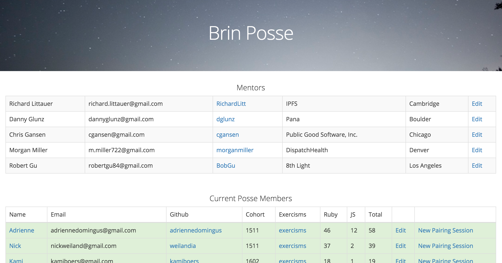

Brin is a basic rails app used to connect a community of programmers who hold each other accountable to regular pairing sessions and continual improvement. The is one unique aspect of this project, however, that make it special: In order to streamline the data show on the app, we implemented a custom API endpoint in the exercism.io codebase to GET user stats.  [Here's some of the code we wrote for exercism.io.](https://github.com/exercism/exercism.io/pull/2818/files).

